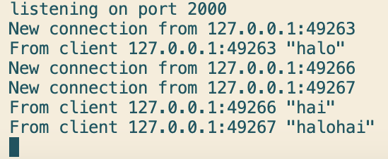
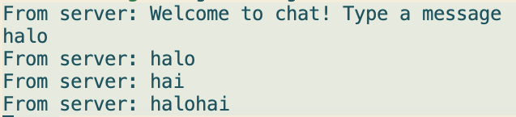
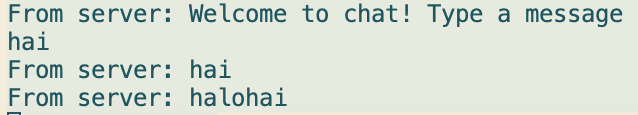
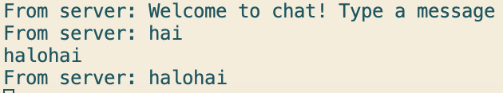
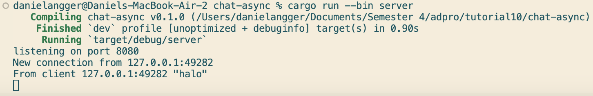
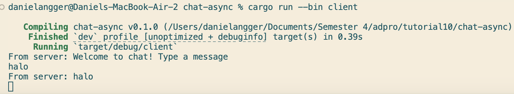

# Tutorial 2: Broadcast Chat

## 2.1: Original code, and how it run

Pada saat saya menjalankan program dan mengetik pesan di salah satu clinet, maka pesan tersebut muncul juga di client yang lain. Hal itu bisa terjadi karena kode ini secara eksplisit mengimplementasikan broadcast (penyiaran) ke semua client menggunakan tokio::sync::broadcast::channel. Jadi, tokio::sync::broadcast::channel(16) membuat channel broadcast, mirip siaran radio, dan setiap client (handle_connection) akan subscribe ke channel ini dengan let mut bcast_rx = bcast_tx.subscribe();. Ketika satu client mengirim pesan ke server, maka server mencetaknya, lalu memanggil bcast_tx.send(text). Ini menyiarkan pesan ke semua receiver (bcast_rx). Semua client lain yang sedang subscribe menerima pesan itu → lalu ws_stream.send(...) mengirimkannya kembali ke client via websocket.

Jadi, ketika Client A mengirim "halo", handle_connection A menerima halo lewat ws_stream.next(). Lalu, server menerima log From client 127.0.0.1:49263 "halo". Lalu, server memanggil bcast_tx.send("halo".into()), yang akan mengirim pesan ke semua subscriber. Lalu, semua bcast_rx.recv() pada tiap task aktif  dan menerima "halo". Lalu, setiap task memanggil ws_stream.send(Message::text(msg)) ke client-nya masing-masing.Jadi, client A dapat "halo" (pesannya sendiri, dikembalikan),client B dapat "halo", client C dapat "halo". Dan juga sama berlaku untuk pesan lain dari B dan C.

## 2.2. Modifying the websocket port

Bila kita ingin mengganti port dari 2000 menjadi 8080, ada beberapa hal yang perlu diperhatikan. Karena disini ada server dan client, maka kita tidak cukup mengganti port di server saja, tetapi juga di sisi client. Dan disni, jelas client masih menggunakan WebSocket protocol, dan itu didefinisikan secara eksplisit di from_uri(...) melalui bagian "ws://...". Tidak ada perbedaan yang berarti setelah merubah port dari 2000 menjadi 8080, karena port merupakan pintu masuk saja. Jadi disini, selama port yang baru (8080) tidak digunakan oleh proses lain (misal server web lokal), maka program akan tetap berjalan sama seperti sebelumnya.

